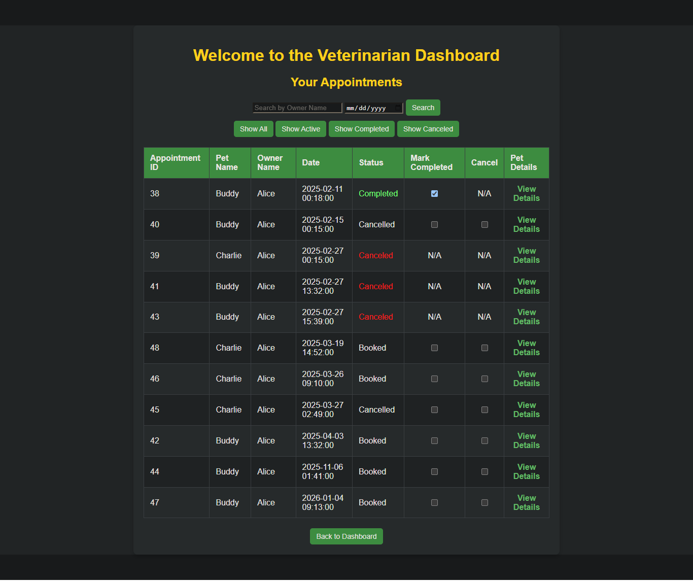
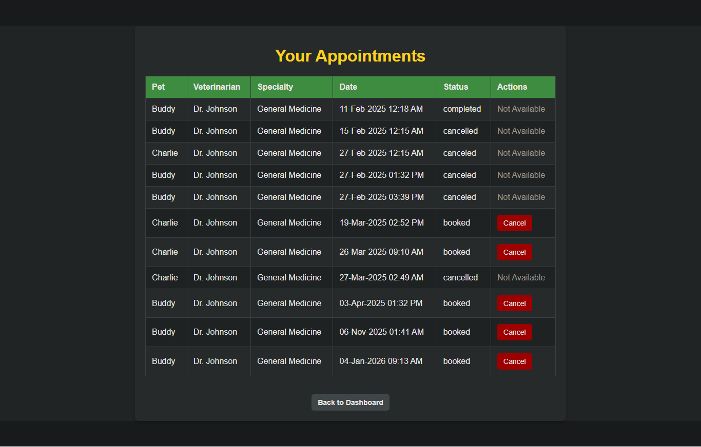
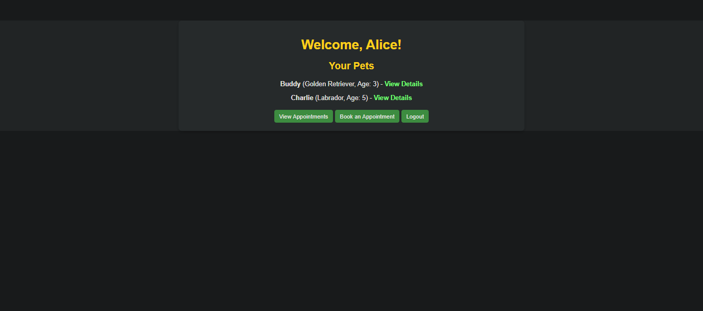
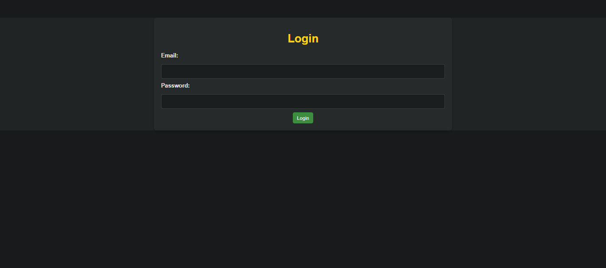
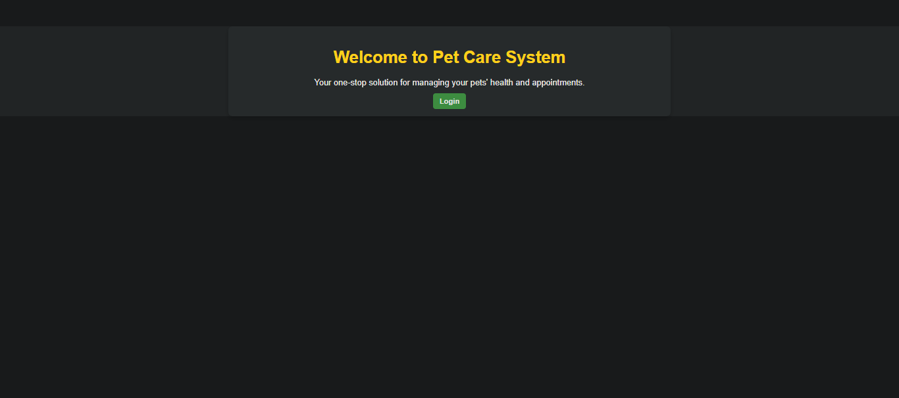

# Pet Care Management System (PCMS)

A web-based platform for pet owners and veterinarians to manage appointments, medical records, and prescriptions.

## ✨ Features

- Pet owners can book appointments and view medical records
- Veterinarians can manage appointments and update treatment details
- Secure login system with password hashing
- Full database integration with MySQL

## 🛠️ Technologies Used

- **Frontend**: HTML, CSS, JavaScript
- **Backend**: PHP
- **Database**: MySQL (Workbench)
- **Server**: XAMPP

## 📁 Project Structure

- `pages/` → All PHP pages (dashboards, forms, etc.)
- `includes/` → Database connection and session handling
- `database/` → SQL files (schema + sample data)
- `assets/` → CSS and JS files

## 🚀 How to Run Locally

### 1. Database Setup

1. Open MySQL Workbench or phpMyAdmin
2. Import `database/schema.sql`
3. Import `database/sample_data.sql` (optional)

### 2. Project Setup

1. Copy the entire `pet_care_system` folder to `htdocs` in XAMPP
2. Start **Apache** and **MySQL**
3. Open browser and go to:  
   `http://localhost/pet_care_system/`

## 📸 Screenshots

### Medical Records & Prescription

### Veterinarian Dashboard

### Book Appointment Form

### Pet Owner's Appointments

### User Dashboard

### Login Page

### Welcome Page

## 📌 Note

University project (Nov 2024 – Mar 2025)  
Associated with NSBM Green University
